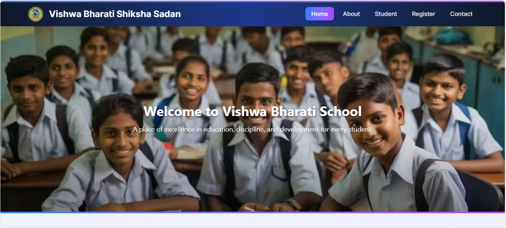
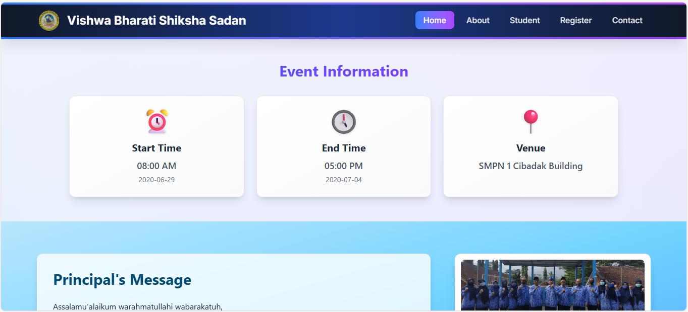
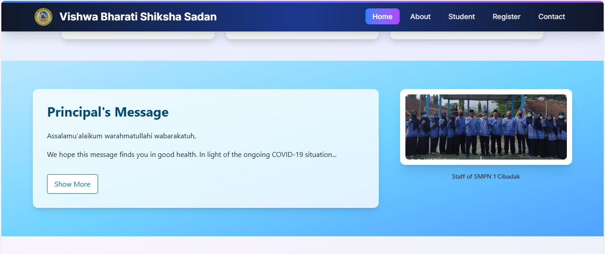
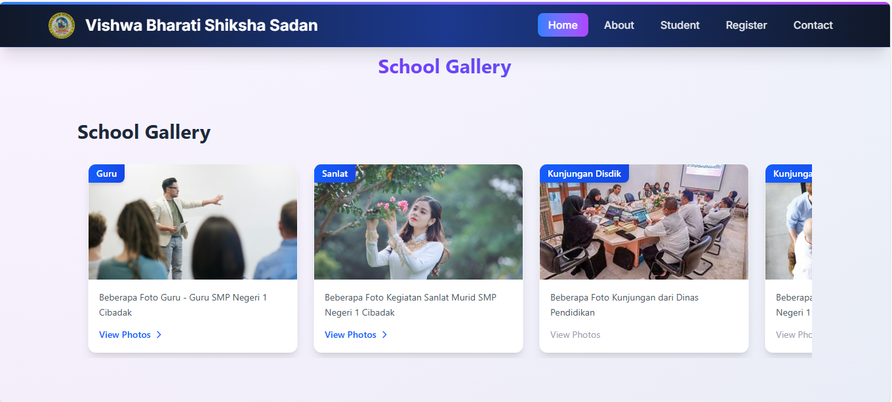
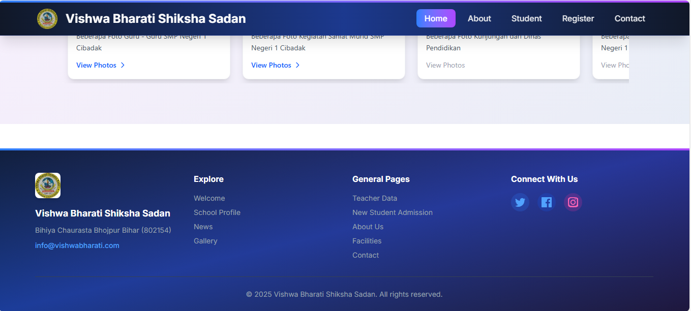
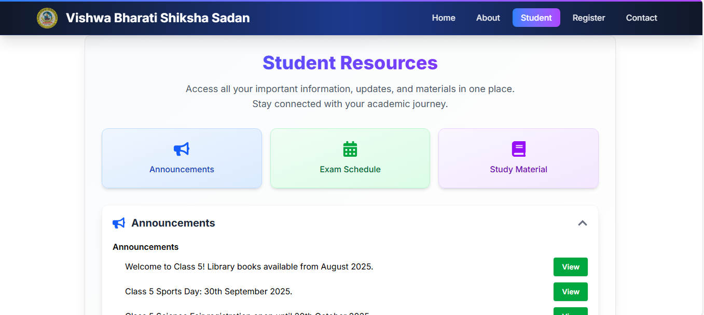
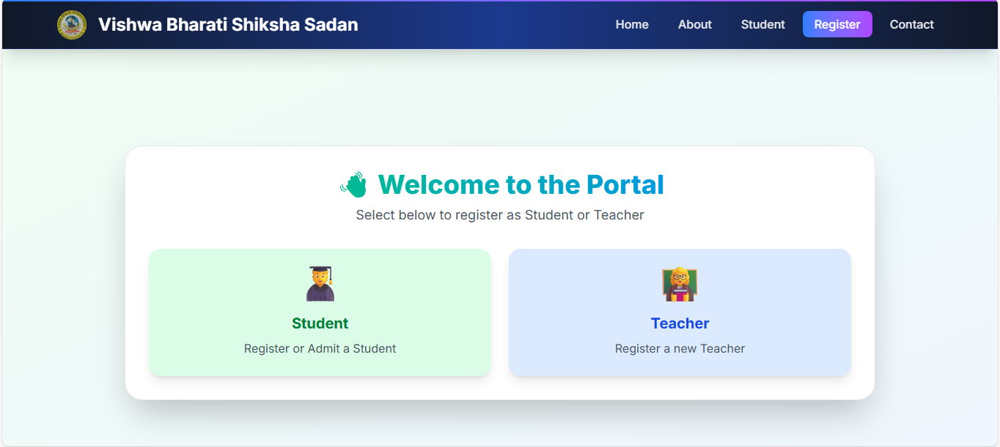
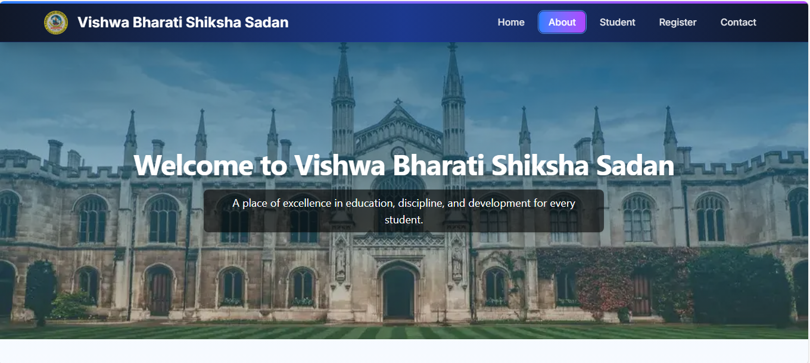
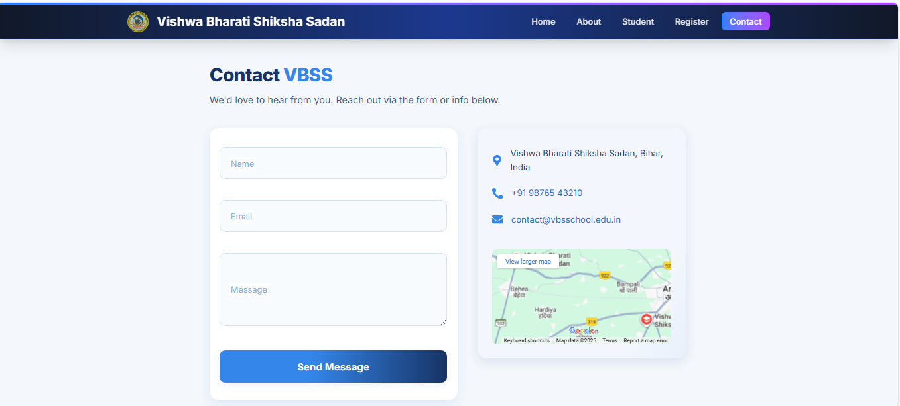

# School Website

A modern, responsive school website built with React and Vite. This project provides an engaging online presence for educational institutions, featuring essential information, interactive features, and a user-friendly interface.

## Features
- Dynamic homepage with announcements and welcome message
- About section detailing the school's vision and history
- Gallery showcasing school events and facilities
- Registration form for new admissions
- Contact page for inquiries
- News and updates
- Principal's message
- Student and teacher profiles
- Exam schedule and assignments
- Performance tracking
- Study materials and class chat

## Technologies Used
- **React** for building interactive user interfaces
- **Vite** for fast development and optimized builds
- **CSS** for styling and responsive design
- **JavaScript** for client-side logic

## Project Structure
```
1. eslint.config.js
2. index.html
3. package.json
4. README.md
5. vite.config.js
6. public/
   └── vite.svg
7. screenshots/
   ├── 1.png
   ├── 2.png
   ├── 3.png
   ├── 4.png
   ├── 5.png
   ├── 6.png
   ├── 7.png
   ├── 8.png
   └── 9.png
8. src/
   ├── App.jsx
   ├── index.css
   ├── main.jsx
   ├── routes.jsx
   ├── assets/
   │   ├── bannerImage.webp
   │   ├── bannerImage2.avif
   │   ├── gallery1.png
   │   ├── gallery1.webp
   │   ├── gallery2.png
   │   ├── gallery3.png
   │   ├── gallery4.png
   │   ├── gallery5.png
   │   ├── gallery6.png
   │   ├── gallery7.png
   │   ├── gallery8.png
   │   ├── gallery9.png
   │   ├── principal-group.png
   │   ├── profile.png
   │   ├── profile1.png
   │   ├── profile2.png
   │   ├── react.svg
   │   └── vbss-logo.png
   ├── components/
   │   ├── Announcements.jsx
   │   ├── Assignments.jsx
   │   ├── Button.jsx
   │   ├── ClassChat.jsx
   │   ├── counter.jsx
   │   ├── ExamSchedule.jsx
   │   ├── Footer.jsx
   │   ├── InfoCard.jsx
   │   ├── Layout.jsx
   │   ├── Navbar.jsx
   │   ├── PerformanceTracking.jsx
   │   ├── PrincipalMessage.jsx
   │   ├── ScrollToTop.jsx
   │   └── StudyMaterial.jsx
   └── pages/
       ├── About.jsx
       ├── Contact.css
       ├── Contact.jsx
       ├── Facilities.jsx
       ├── Gallery.jsx
       ├── Home.jsx
       ├── News.jsx
       ├── Registration.jsx
       ├── Sanlat.jsx
       ├── Schoolprofile.jsx
       ├── Student.jsx
       ├── Teacherdata.jsx
       └── Welcome.jsx
```

## How It Works
- The application is structured using reusable React components for maintainability and scalability.
- Routing is handled to provide seamless navigation between pages like Home, About, Gallery, Registration, and more.
- State management is implemented using React hooks for dynamic content such as announcements and performance tracking.
- Forms (e.g., registration, contact) include validation and user feedback.
- Assets and images are organized for quick access and efficient loading.

## Getting Started

### Prerequisites
- Node.js (v18 or above recommended)
- npm (comes with Node.js)

### Installation
1. Clone the repository:
   ```bash
   git clone https://github.com/your-org/school-website-team4.git
   ```
2. Navigate to the project directory:
   ```bash
   cd school-website-team4
   ```
3. Install dependencies:
   ```bash
   npm install
   ```

### Running the Development Server
Start the local server:
```bash
npm run dev
```
Open [http://localhost:5173](http://localhost:5173) in your browser to view the site.

### Building for Production
To create an optimized production build:
```bash
npm run build
```
The output will be in the `dist` folder.

## Contribution Guidelines
Contributions are welcome! Please open issues or submit pull requests for improvements or bug fixes. Follow best practices for React and maintain code readability.

## Contributors
- Pulipati V N Chetan Kumar
- Bansal Premkumar Yashavantkumar
- Shivam Kumar
- Shivam Sourav
- Mayank Patel
- Satyam Singh
- Pruthvi
- Aditya Rajhans

## License
This project is licensed under the MIT License.

## Screenshots
Below are some screenshots of the school website:

| Home Page | Gallery | Registration |
|-----------|--------|--------------|
|  |  |  |

| News & Updates | Principal's Message | Student Profile |
|----------------|--------------------|-----------------|
|  |  |  |

| Teacher Profile | Exam Schedule | Performance Tracking |
|-----------------|--------------|----------------------|
|  |  |  |
